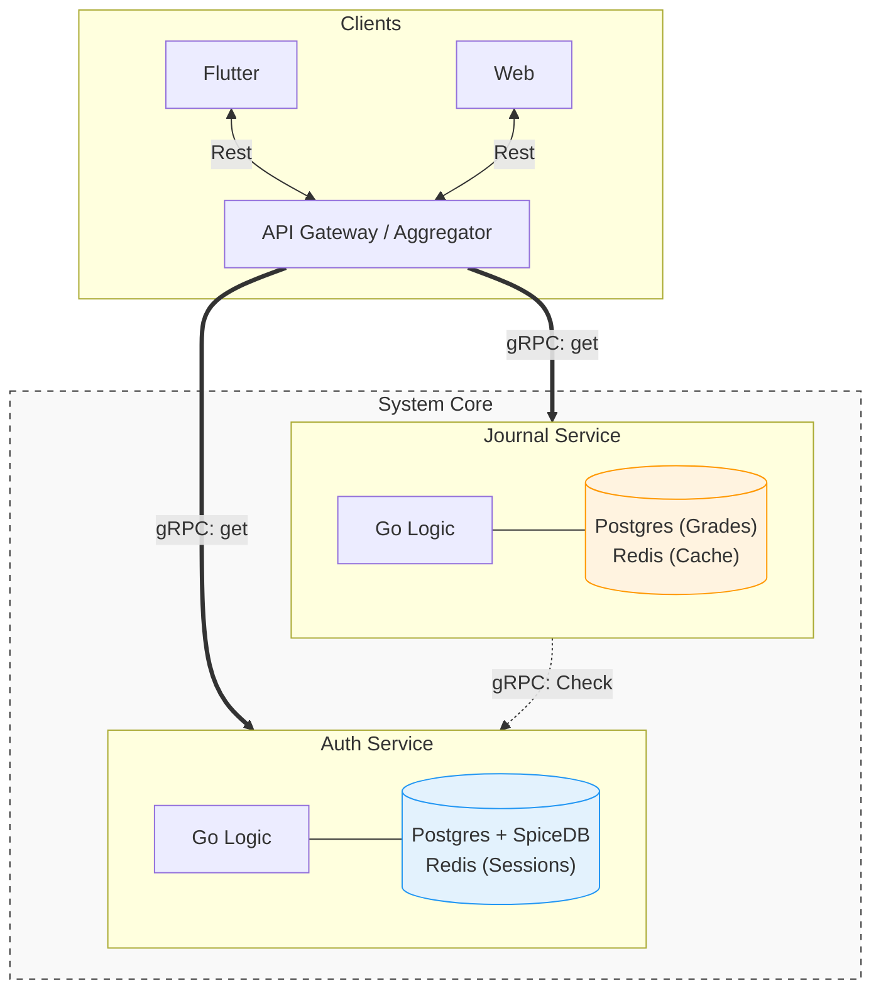
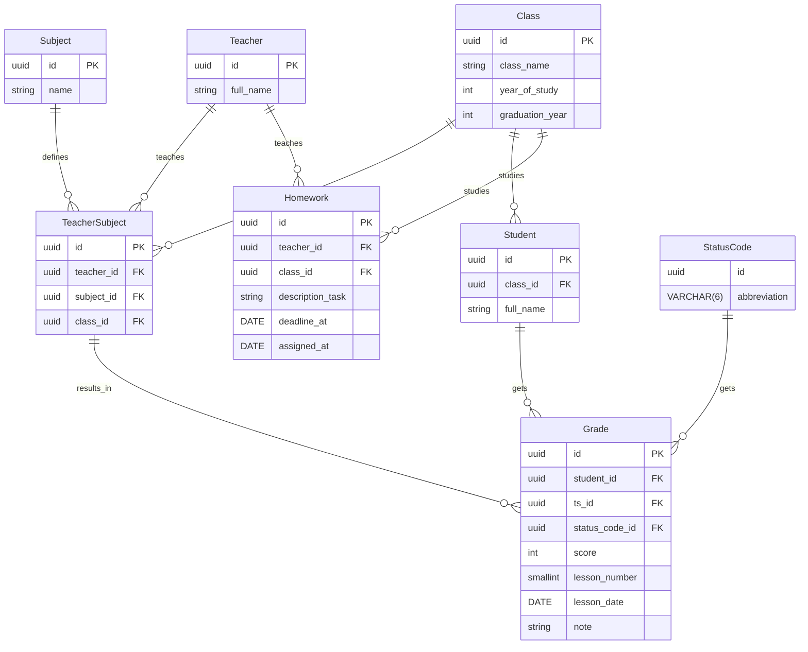

<!-- markdownlint-disable MD033 -->

# Проектирование системы EduFlow

---

## 1. Концепция и решаемые задачи

**EduFlow** представляет собой информационную систему управления образовательным процессом, спроектированную для автоматизации ведения классного журнала, учета посещаемости и мониторинга академической успеваемости.

Основная цель проекта — минимизация бюрократической нагрузки на преподавательский состав и обеспечение прозрачного, оперативного доступа к учебным данным для администрации и учащихся.

## 2. Архитектурное решение

Система базируется на **микросервисной архитектуре**, что обеспечивает независимое масштабирование модулей и высокую отказоустойчивость. Взаимодействие компонентов организовано через единую точку входа — **API Gateway**, выполняющий функции обратного проксирования и агрегации данных в рамках паттерна **BFF (Backend for Frontend)**.

### Ключевые технологические стеки

* **Транспортный уровень:** Гибридная модель взаимодействия. Внешний контур использует **REST (JSON)** для обеспечения совместимости с клиентскими приложениями (Flutter, Web). Внутренний контур построен на высокопроизводительном протоколе **gRPC (Protobuf)**, обеспечивающем строгую типизацию и бинарную сериализацию данных.
* **Слой бизнес-логики:** Микросервисы реализованы на языке **Go (Golang)**. Выбор обусловлен эффективной моделью конкурентности, малым потреблением ресурсов и высокой скоростью обработки сетевых запросов.
* **Слой данных:** Реализован паттерн **Database-per-Service**. Каждая функциональная область обладает собственной изолированной БД (**PostgreSQL**) и выделенным слоем кэширования (**Redis**). Для управления уникальными идентификаторами в распределенной среде используется стандарт **UUID v7**.
* **Безопасность и контроль доступа:** Централизованный сервис авторизации интегрирован с **SpiceDB** (реализация модели Google Zanzibar). Это позволяет внедрить графовую систему прав доступа (**ReBAC**), обеспечивая гибкое управление полномочиями (учитель, староста, администратор) на уровне конкретных объектов системы.

---

## 3. API Gateway (KrakenD)

В качестве единой точки входа и агрегатора данных в системе используется высокопроизводительный L7-шлюз **KrakenD**. Его основная задача — реализация паттерна **BFF (Backend for Frontend)**, что позволяет абстрагировать сложность микросервисной архитектуры от клиентских приложений (Flutter, Web).

### Основные функции и механизмы

* **Трансформация протоколов (gRPC-JSON Transcoding):** KrakenD принимает внешние HTTP/REST запросы в формате JSON и преобразует их во внутренние gRPC-вызовы к сервисам `Auth` и `Journal`. Это позволяет использовать преимущества бинарного протокола внутри кластера, сохраняя простоту интеграции для фронтенд-разработки.

* **Агрегация запросов (Endpoints Aggregation):** Шлюз позволяет минимизировать количество сетевых задержек (RTT) для мобильных устройств. Например, при запросе «страницы журнала» KrakenD выполняет параллельные запросы к сервисам для получения оценок, данных учеников и проверки прав доступа, формируя единый консолидированный ответ.

* **Безопасность и Валидация:**
  * **JWT Validation:** Проверка подписи и срока действия токена на уровне шлюза до проброса запроса в бизнес-логику.
  * **Header Manipulation:** Извлечение `user_id` из токена и его инъекция в gRPC-метаданные для последующей идентификации пользователя внутри системы.
* **Оптимизация трафика:**
  * **Throttling & Rate Limiting:** Защита микросервисов от лавинообразных запросов.
  * **Response Manipulation:** Удаление избыточных полей из ответов микросервисов для экономии мобильного трафика пользователей.

### Логика работы на примере запроса «Журнал класса»

1. **Клиент:** Отправляет `GET /v1/journal/{class_id}` с Bearer-токеном.
2. **KrakenD:**
   * Проверяет валидность JWT.
   * Инициирует gRPC-вызов в **Auth Service** для подтверждения прав субъекта на доступ к ресурсу `class_id` (через SpiceDB).
   * Параллельно запрашивает данные об успеваемости и профилях учащихся из **Journal Service**.
3. **Агрегатор:** Сопоставляет полученные данные и возвращает фронтенду структурированный JSON, готовый к отрисовке без дополнительной обработки на клиенте.

## Jurnal service

Journal Service является центральным хранилищем и поставщиком всех данных, связанных с организацией и ведением образовательного процесса. Сервис управляет:

* учебными классами и группами;
* списком предметов и учебных планов;
* привязкой учителей к предметам и классам;
* составом учащихся по классам;
* успеваемостью (оценки, средние баллы);
* посещаемостью занятий;
* расписанием и домашними заданиями (при необходимости).

### Endpoints: Journal Microservice

#### 1. Students (Студенты)

| Method | Request | Response | Description |
| :--- | :--- | :--- | :--- |
| **CreateStudent** | CreateStudentRequest | | Добавление нового студента |
| **GetStudent** | GetStudentRequest | Student | Получение данных студента по ID |
| **ListStudents** | ListStudentsRequest | ListStudentsResponse | Список студентов с фильтрацией |
| **UpdateStudent** | UpdateStudentRequest | Student | Обновление информации о студенте |
| **DeleteStudent** | DeleteStudentRequest | | Удаление студента из системы |

#### 2. Teachers (Учителя)

| Method | Request | Response | Description |
| :--- | :--- | :--- | :--- |
| **CreateTeacher** | CreateTeacherRequest | | Добавление нового преподавателя |
| **ListTeachers** | ListTeachersRequest | ListTeachersResponse | Получение списка всех учителей |
| **UpdateTeacher** | UpdateTeacherRequest | Teacher | Обновление данных преподавателя |
| **DeleteTeacher** | DeleteTeacherRequest | | Удаление преподавателя |

#### 3. Classes & Subjects (Классы и Предметы)

| Method | Request | Response | Description |
| :--- | :--- | :--- | :--- |
| **CreateClass** | CreateClassRequest | | Создание нового учебного класса |
| **GetClass** | GetClassRequest | Class | Получение данных класса по ID |
| **ListTeacherClasses** | ListTeacherClassesRequest | ListClassesResponse | Список классов конкретного учителя |
| **UpdateClass** | UpdateClassRequest | Class | Изменение данных класса |
| **DeleteClass** | DeleteClassRequest | | Удаление класса |
| **CreateSubject** | CreateSubjectRequest | | Добавление учебного предмета |
| **UpdateSubject** | UpdateSubjectRequest | Subject | Изменение названия или данных предмета |
| **DeleteSubject** | DeleteSubjectRequest | | Удаление предмета |

#### 4. Grades (Оценки)

| Method | Request | Response | Description |
| :--- | :--- | :--- | :--- |
| **RecordGrade** | RecordGradeRequest | | Выставить оценку студенту |
| **GetGrade** | GetGradeRequest | Grade | Получение данных конкретной оценки |
| **ListGrades** | ListGradesRequest | ListGradesResponse | Ведомость оценок (фильтр по классу/предмету) |
| **UpdateGrade** | UpdateGradeRequest | Grade | Изменение выставленной оценки |
| **DeleteGrade** | DeleteGradeRequest | | Удаление записи об оценке |

#### 5. Homework (Домашнаяя работа)

| Method | Request | Response | Description |
| :--- | :--- | :--- | :--- |
| **RecordHmework** | RecordHmeworkRequest | | Написать домашнее задание |
| **UpdateHmework** | UpdateHmeworkRequest | | Обновить данные домашнего задания |
| **ListHomework** | ListHomeworkRequest | ListHomeworkRespone | Получение списка домашних заданий (Метод сильно зависит от того кто делает запрос) |
| **DeleteHomework** | DeliteHomeworkRequest | | Удаление домашнего задания |

#### 6. Status code (Статус коды)

| Method | Request | Response | Description |
| :--- | :--- | :--- | :--- |
| **RecordStatusCode** | RecordStatusCodeRequest | | Создать статус-код |
| **UpdateStatusCode** | UpdateStatusCodeRequest | | Обновить статус-код |
| **ListStatusCode** | ListStatusCodeRequest | ListStatusCodeReapone | Получение список статус-кодов |
| **DeleteStatusCode** | DeleteStatusCodeRequest | | Удаление статус-кода |

Структуры (proto)

[embedmd]:# (../api/proto/journal/v1/journal.proto protobuf)

### Модель данных

Все сущности хранятся в изолированной PostgreSQL, а для повышения производительности используется Redis

#### Описание статус кодов

| Code | discription |
| :--- | :--- |
| DEBT | Задолженность. Работа не сдана в срок («точка» в журнале) |
| ABSENT | Отсутствие. Ученика не было на уроке без объяснения причины |
| SICK | Болезнь. Отсутствие по медицинской справке |
| EXCUSE | Уважительная. Семейные обстоятельства, заявление от родителей |
| RETAKE | Пересдача. Оценка, полученная при исправлении предыдущей |
| EXEMPT | Освобожден. Например, освобождение от физкультуры или зачета |

SQL код

[embedmd]:# (../migrations/000001_init.up.sql)

## Auth service

...
