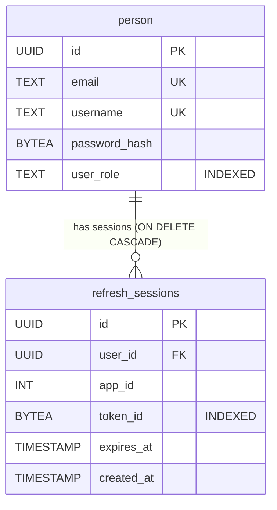

# Схема БД sso

```mermaid
erDiagram
    person {
        UUID id PK
        TEXT email UK
        TEXT username UK
        BYTEA password_hash
        TEXT user_role "INDEXED"
    }

    refresh_sessions {
        UUID id PK
        UUID user_id FK
        INT app_id
        BYTEA token_id "INDEXED"
        TIMESTAMP expires_at
        TIMESTAMP created_at
    }

    person ||--o{ refresh_sessions : "has sessions (ON DELETE CASCADE)"
```
